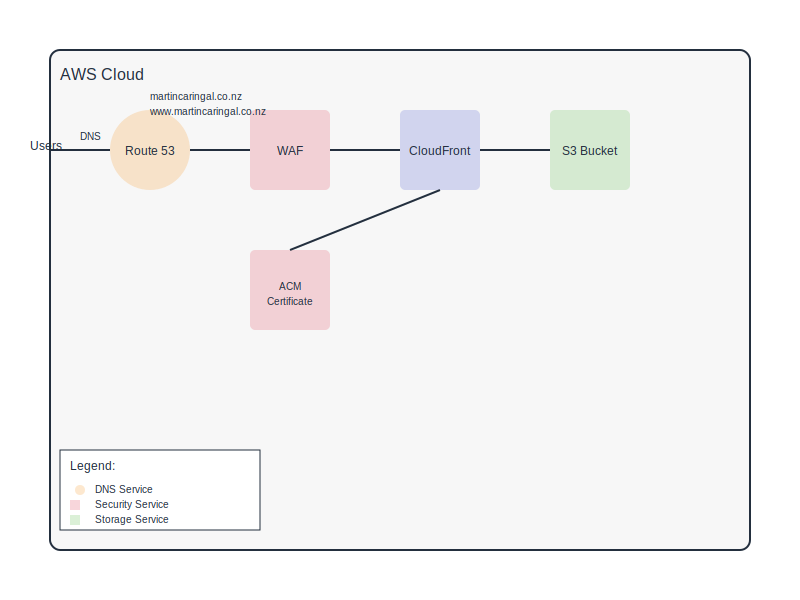

# Static React Website Infrastructure

This repository contains Terraform configurations for deploying a static React website on AWS with CloudFront distribution and WAF protection.

## Infrastructure Overview



The infrastructure consists of:

- **S3 Bucket**: Hosts the React application build files
- **CloudFront**: CDN distribution with edge caching
- **Route53**: DNS management for domain routing
- **ACM**: SSL/TLS certificate management
- **WAF**: Web Application Firewall for security

## Prerequisites

- AWS CLI installed and configured
- Terraform (version >= 1.0.0)
- A registered domain in Route53
- Sufficient AWS permissions to create required resources

## Required AWS Permissions

The AWS user executing these Terraform configurations needs the following permissions:
```json
{
    "Version": "2012-10-17",
    "Statement": [
        {
            "Effect": "Allow",
            "Action": [
                "s3:CreateBucket",
                "s3:PutBucketPolicy",
                "s3:PutBucketVersioning",
                "s3:PutBucketCORS",
                "s3:PutObject",
                "s3:GetObject",
                "s3:ListBucket"
            ],
            "Resource": [
                "arn:aws:s3:::caringalfrontend",
                "arn:aws:s3:::caringalfrontend/*"
            ]
        },
        {
            "Effect": "Allow",
            "Action": [
                "cloudfront:*",
                "wafv2:*",
                "acm:*",
                "route53:*"
            ],
            "Resource": "*"
        }
    ]
}
```

## Project Structure

```plaintext
.
├── cloudfront.tf       # CloudFront distribution configuration
├── dns.tf             # Route53 and ACM certificate configuration
├── iam.tf             # IAM policies for S3 bucket access
├── outputs.tf         # Output values
├── provider.tf        # AWS provider configuration
├── s3.tf             # S3 bucket configuration
├── variables.tf       # Variable definitions
└── waf.tf            # WAF configuration
```

## Configuration Files

- **cloudfront.tf**: Configures CloudFront distribution with origin access control
- **dns.tf**: Sets up DNS records and SSL certificate
- **iam.tf**: Defines IAM policies for CloudFront access to S3
- **s3.tf**: Creates and configures the S3 bucket for static hosting
- **waf.tf**: Implements WAF rules for security
- **variables.tf**: Defines input variables
- **outputs.tf**: Defines output values
- **provider.tf**: Configures AWS provider

## Variables

| Name | Description | Default |
|------|-------------|---------|
| aws_region | AWS region | ap-southeast-2 |
| s3_bucket_name | Name of the S3 bucket | caringalfrontend |
| environment | Environment name | production |
| domain_name | Root domain name | martincaringal.co.nz |
| www_domain_name | WWW domain name | www.martincaringal.co.nz |

## Usage

1. Initialize Terraform:
```bash
terraform init
```

2. Review the execution plan:
```bash
terraform plan
```

3. Apply the configuration:
```bash
terraform apply
```

4. After successful deployment, upload your React build files:
```bash
aws s3 sync ./build s3://caringalfrontend/react-build --delete
```

## Security Features

1. **WAF Protection**:
   - Rate limiting (2000 requests per 5 minutes per IP)
   - AWS managed rule sets for common vulnerabilities
   - IP reputation checking

2. **S3 Security**:
   - Private bucket access
   - CloudFront Origin Access Control
   - CORS configuration for secure access

3. **SSL/TLS**:
   - ACM certificate for HTTPS
   - TLS 1.2 minimum protocol version

## Outputs

| Name | Description |
|------|-------------|
| cloudfront_domain_name | Domain name of CloudFront distribution |
| cloudfront_distribution_id | ID of CloudFront distribution |
| s3_bucket_name | Name of the S3 bucket |

## Maintenance

- Regularly update AWS provider version
- Monitor WAF metrics in CloudWatch
- Review S3 bucket versioning for content management
- Check CloudFront cache settings optimization

## Cost Optimization

- Using PriceClass_200 for CloudFront (covers NA, Europe, Asia, Middle East, and Africa)
- S3 Standard storage for static content
- WAF charged per rule and request

## Cleanup

To destroy the infrastructure:
```bash
terraform destroy
```

## Support

For issues or questions:
- Review AWS documentation
- Check CloudWatch logs
- Monitor WAF metrics

## Notes

- Domain must be registered in Route53
- SSL certificate is created in us-east-1 region (required for CloudFront)
- CloudFront distribution can take up to 15 minutes to deploy