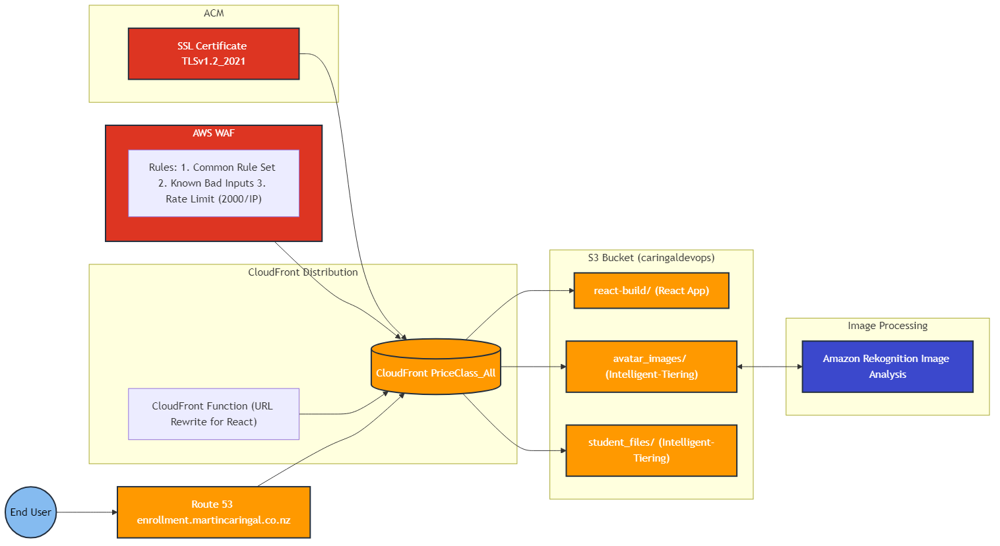

# AWS Frontend Infrastructure for Student Enrollment System

This repository contains Terraform configurations for deploying a secure and scalable web infrastructure on AWS, designed to serve a Student Record System built with React.


Related Repositories:

- Frontend Web Application: [CaringalML/Student-Enrollment-System-React](https://github.com/CaringalML/Student-Enrollment-System-React)
- Backend Web Application: [CaringalML/Student-Enrollment-System-Laravel-API](https://github.com/CaringalML/Student-Enrollment-System-Laravel-API)
- Backend Infrastructure: [CaringalML/AWS-Laravel-RESTful-API-Backend-Infrastructure](https://github.com/CaringalML/AWS-Laravel-RESTful-API-Backend-Infrastructure)

## Table of Contents
1. [Architecture Overview](#architecture-overview)
2. [Prerequisites](#prerequisites)
3. [Quick Start](#quick-start)
4. [Component Details](#component-details)
5. [Security Features](#security-features)
6. [Infrastructure Management](#infrastructure-management)
7. [Monitoring and Operations](#monitoring-and-operations)
8. [Troubleshooting](#troubleshooting)
9. [Development](#development)
10. [CI/CD Pipeline](#cicd-pipeline)
11. [Deployment Results](#deployment-results)
12. [Infrastructure Costs](#infrastructure-cost-estimation-usd)
13. [Support and Maintenance](#support-and-maintenance)


## Architecture Overview

The infrastructure consists of:
- CloudFront distribution for content delivery
- S3 bucket for storage with intelligent tiering
- WAF for security
- Route53 for DNS management (martincaringal.co.nz)
- ACM for SSL/TLS certificates

### Infrastructure Diagram



### Key Components
- **CloudFront Distribution**: Serves the React-based Student Record System
- **S3 Bucket**: Stores static files and student-related media content
- **WAF**: Provides web application firewall protection
- **Route53**: Manages DNS records
- **ACM**: Handles SSL/TLS certificates
- **Amazon Rekognition**: Shown in diagram for avatar image validation, but processing is handled by Laravel backend (not part of this infrastructure)

## Prerequisites

- AWS Account
- Terraform ≥ 1.0.0
- AWS CLI configured with appropriate credentials
- Domain registered in Route53 (martincaringal.co.nz)

## Quick Start

1. Clone the repository:
```bash
git clone https://github.com/CaringalML/AWS-React-Frontend-Infrastructure.git
cd AWS-React-Frontend-Infrastructure
```

2. Initialize Terraform:
```bash
terraform init
```

3. Review and modify variables in `variables.tf`:
```hcl
variable "domain_name" {
  description = "Custom domain name"
  default     = "enrollment.martincaringal.co.nz"
}

variable "environment" {
  description = "Environment name"
  default     = "production"
}

variable "aws_region" {
  description = "AWS region"
  default     = "ap-southeast-2"
}
```

4. Format and validate Terraform code:
```bash
terraform fmt
terraform validate
```

5. Review the infrastructure plan:
```bash
terraform plan  
```

6. Apply the infrastructure:
```bash
terraform apply 
```

## Component Details

### CloudFront Distribution

1. **Basic Configuration**
   - IPv6 enabled
   - Price class: All edge locations
   - HTTPS enforcement
   - TLSv1.2_2021 minimum protocol version

2. **Origin Configuration**
   - React App origin (/react-build)
   - Media files origin
   - Origin Access Control (OAC) implementation

3. **CloudFront Function**
```javascript
function handler(event) {
    var request = event.request;
    var uri = request.uri;
    
    // Check whether the URI is missing a file extension
    if (!uri.includes('.')) {
        request.uri = '/index.html';
    }
    
    return request;
}
```

### S3 Bucket Structure

The S3 bucket (`caringaldevops`) is organized with the following structure:

1. `/avatar_images/`
   - Purpose: Stores user avatar images
   - Storage: Immediate transition to Intelligent-Tiering
   - Access: Through CloudFront only
    - Note: While Amazon Rekognition is shown in the infrastructure diagram, image validation 
     is processed by Laravel backend before storing in this directory

2. `/react-build/`
   - Purpose: Contains Student Record System React application build files
   - Access: Served as main application through CloudFront

3. `/student_files/`
   - Purpose: Stores student-related files and documents
   - Storage: Immediate transition to Intelligent-Tiering
   - Access: Through CloudFront only

### WAF Configuration Details

The WAF implementation includes:

1. AWS Managed Rules - Common Rule Set
   - Priority: 1
   - Vendor: AWS
   - Metrics Enabled: Yes

2. AWS Managed Rules - Known Bad Inputs
   - Priority: 2
   - Vendor: AWS
   - Metrics Enabled: Yes

3. Rate Limiting Rule
   - Priority: 3
   - Limit: 2000 requests per IP
   - Action: Block
   - Metrics Enabled: Yes

### S3 Storage Management

1. **Intelligent Tiering Configuration**
```hcl
# Archive tier configuration
tiering {
  access_tier = "ARCHIVE_ACCESS"
  days        = 90
}

# Deep archive tier configuration
tiering {
  access_tier = "DEEP_ARCHIVE_ACCESS"
  days        = 365
}
```

2. **Lifecycle Rules**
   - Avatar Images: Immediate transition to Intelligent-Tiering for student photos
   - Student Files: Immediate transition to Intelligent-Tiering for academic records
   - Cleanup: Abort incomplete multipart uploads after 7 days

3. **Access Control**
   - Public access blocked for student data security
   - CloudFront OAC access only
   - CORS configuration for Student Record System API access

## Security Features

### Access Control
1. **S3 Bucket Security**
```hcl
resource "aws_s3_bucket_public_access_block" "storage_bucket" {
  bucket = aws_s3_bucket.storage_bucket.id
  block_public_acls       = true
  block_public_policy     = true
  ignore_public_acls      = true
  restrict_public_buckets = true
}
```

2. **CloudFront Security**
   - Origin Access Control (OAC) for secure file access
   - HTTPS enforcement for student data protection
   - TLSv1.2_2021 minimum protocol
   - Custom SSL certificate for enrollment.martincaringal.co.nz

3. **WAF Protection**
   - Rate limiting (2000 requests/IP)
   - AWS managed rule sets
   - Custom security rules for student record protection
   - Metrics and logging enabled for audit purposes

## Infrastructure Management

### Resource Organization
```
AWS-React-Frontend-Infrastructure/
├── cloudfront.tf         # CloudFront and function configurations
├── s3.tf                # S3 bucket configurations
├── waf.tf               # WAF configurations
├── dns.tf               # Route53 and SSL configurations
├── iam.tf               # IAM policies
├── lifecycle.tf         # S3 lifecycle rules
├── variables.tf         # Variable definitions
└── README.md           # Documentation
```

### Domain and SSL Management

1. **Route53 Configuration**
```hcl
resource "aws_route53_record" "cloudfront" {
  zone_id = data.aws_route53_zone.main.zone_id
  name    = var.domain_name
  type    = "A"

  alias {
    name                   = aws_cloudfront_distribution.s3_distribution.domain_name
    zone_id                = aws_cloudfront_distribution.s3_distribution.hosted_zone_id
    evaluate_target_health = false
  }
}
```

2. **SSL Certificate**
   - Automatic validation through Route53
   - Auto-renewal enabled for continuous security
   - us-east-1 region requirement for CloudFront compatibility


   ## Monitoring and Operations

### CloudWatch Monitoring

1. **Metrics Available**
   - CloudFront error rates
   - WAF blocked requests
   - S3 bucket operations for student records
   - Origin latency monitoring

2. **Suggested Alarms**
```hcl
resource "aws_cloudwatch_metric_alarm" "error_rate" {
  alarm_name          = "${var.environment}-high-error-rate"
  comparison_operator = "GreaterThanThreshold"
  evaluation_periods  = "2"
  metric_name        = "5xxErrorRate"
  namespace          = "AWS/CloudFront"
  period             = "300"
  statistic          = "Average"
  threshold          = "5"
}
```

### Logging Configuration

1. **WAF Logging**
   - Security event tracking
   - Sampled requests for analysis
   - Metrics enabled for threat detection

2. **CloudFront Logging**
   - Access logs for audit trails
   - Error logs for troubleshooting
   - Cache statistics for performance optimization

## Troubleshooting

### Common Issues and Solutions

1. **CloudFront 403 Errors**
   - Check S3 bucket policy configuration:
   ```hcl
   {
     "Version": "2012-10-17",
     "Statement": [{
       "Sid": "AllowCloudFrontServicePrincipal",
       "Effect": "Allow",
       "Principal": {
         "Service": "cloudfront.amazonaws.com"
       },
       "Action": [
         "s3:GetObject",
         "s3:PutObject",
         "s3:DeleteObject",
         "s3:ListBucket"
       ],
       "Resource": [
         "arn:aws:s3:::caringaldevops/*",
         "arn:aws:s3:::caringaldevops"
       ],
       "Condition": {
         "StringEquals": {
           "AWS:SourceArn": "[DISTRIBUTION_ARN]"
         }
       }
     }]
   }
   ```
   - Verify OAC configuration for student file access
   - Check WAF rules for false positives
   - Validate function associations for React routing

2. **SSL Certificate Issues**
   - Verify ACM certificate region (must be us-east-1)
   - Check DNS validation records
   - Confirm domain ownership
   - Review certificate renewal status

## Development

### Local Development Setup

1. **Environment Setup**
```bash
# Install required tools
brew install terraform awscli

# Configure AWS credentials
aws configure

# Clone repository
git clone https://github.com/CaringalML/AWS-React-Frontend-Infrastructure.git
cd AWS-React-Frontend-Infrastructure
```

2. **Development Best Practices**
   - Use terraform workspaces for different environments
   - Keep sensitive variables in terraform.tfvars
   - Use consistent naming conventions
   - Document all changes

### Testing and Validation

1. **Infrastructure Testing**
```bash
# Validate Terraform configurations
terraform validate

# Check formatting
terraform fmt

# Plan changes
terraform plan
```

2. **Application Deployment Testing**
```bash
# Build React application
npm run build

# Test S3 upload
aws s3 sync ./build s3://caringaldevops/react-build --delete

# Verify CloudFront distribution
Invoke-WebRequest -Uri "https://enrollment.martincaringal.co.nz" -Method Head
```


## CI/CD Pipeline

### GitHub Actions Workflow

The project uses GitHub Actions for continuous integration and deployment, automatically building and deploying the React application to AWS infrastructure.

### Workflow Overview

The CI/CD pipeline triggers on:
- Push events to the `main` branch
- Pull requests to the `main` branch

### Pipeline Steps

1. **Environment Setup**
   - Runs on Ubuntu latest
   - Uses Node.js 20.x
   - Configures npm cache for faster builds

2. **Dependency Management**
   - Checks for existing node_modules
   - Installs dependencies using `npm ci` if needed
   - Creates necessary environment files

3. **Build Process**
   - Builds the React application with production settings
   - Uses environment variables from GitHub Secrets

4. **AWS Deployment**
   - Configures AWS credentials
   - Syncs build output to S3 bucket
   - Invalidates CloudFront cache

### Required Secrets

Configure the following secrets in your GitHub repository:

```
AWS_ACCESS_KEY_ID          - AWS IAM user access key
AWS_SECRET_ACCESS_KEY      - AWS IAM user secret key
REACT_APP_API_URL         - Backend API URL
CLOUDFRONT_DISTRIBUTION_ID - CloudFront distribution ID
```

### Workflow Configuration

```yaml
name: React CI/CD

on:
  push:
    branches: ["main"]
  pull_request:
    branches: ["main"]

jobs:
  build:
    runs-on: ubuntu-latest
    
    strategy:
      matrix:
        node-version: [20.x]

    steps:
      - uses: actions/checkout@v4
      - name: Use Node.js ${{ matrix.node-version }}
        uses: actions/setup-node@v4
        with:
          node-version: ${{ matrix.node-version }}
          cache: 'npm'

      - name: Check Dependencies
        id: check-deps
        run: |
          if [ ! -d "node_modules" ]; then
            echo "❌ node_modules directory is missing"
            echo "missing_dependencies=1" >> $GITHUB_OUTPUT
          else
            echo "✅ node_modules directory exists"
            echo "missing_dependencies=0" >> $GITHUB_OUTPUT
          fi

      - name: Install Dependencies
        if: steps.check-deps.outputs.missing_dependencies == 1
        run: npm ci

      - name: Create .env file
        run: |
          touch .env
          echo "REACT_APP_API_URL=${{ secrets.REACT_APP_API_URL }}" >> .env

      - name: Build
        run: npm run build
        env:
          REACT_APP_API_URL: ${{ secrets.REACT_APP_API_URL }}

      - name: Configure AWS Credentials
        uses: aws-actions/configure-aws-credentials@v1
        with:
          aws-access-key-id: ${{ secrets.AWS_ACCESS_KEY_ID }}
          aws-secret-access-key: ${{ secrets.AWS_SECRET_ACCESS_KEY }}
          aws-region: ap-southeast-2

      - name: Deploy to S3
        run: aws s3 sync ./build s3://caringaldevops/react-build --delete

      - name: Invalidate CloudFront
        run: |
          aws cloudfront create-invalidation --distribution-id ${{ secrets.CLOUDFRONT_DISTRIBUTION_ID }} --paths "/*"
```

### Pipeline Maintenance

1. **Regular Tasks**
   - Monitor workflow runs
   - Review deployment success rates
   - Check build performance
   - Update Node.js version as needed

2. **Security Considerations**
   - Rotate AWS credentials regularly
   - Review and update GitHub secrets
   - Maintain principle of least privilege for AWS IAM roles


## Support and Maintenance

### Regular Maintenance

1. **Daily Tasks**
   - Monitor WAF blocks and security events
   - Check student record access patterns
   - Verify backup completion

2. **Weekly Tasks**
   - Review security updates
   - Optimize cost for storage and distribution
   - Analyze performance metrics

3. **Monthly Tasks**
   - Security assessment
   - Resource optimization review
   - Compliance verification

### Contact Information

For support and assistance:
- Technical Issues: lawrencecaringal5@gmail.com
- Infrastructure Support: [GitHub Issues](https://github.com/CaringalML/AWS-React-Frontend-Infrastructure/issues)

## Variable Reference

| Name | Description | Type | Default | Required |
|------|-------------|------|---------|:--------:|
| aws_region | AWS Region | string | ap-southeast-2 | no |
| environment | Environment name | string | production | no |
| domain_name | Custom domain name | string | enrollment.martincaringal.co.nz | no |
| s3_bucket_name | S3 bucket name | string | caringaldevops | no |


## Deployment Results

### CloudFront Distribution

- Distribution active: enrollment.martincaringal.co.nz
- HTTPS enabled with SSL certificate
- Global edge locations configured

#### Origins Configuration

1. **S3-React-App Origin**
   - Domain: caringaldevops.s3.ap-southeast-2.amazonaws.com
   - Origin Path: /react-build
   - OAC: Enabled
   - Purpose: Serves main React application

2. **S3-Media Origin**
   - Domain: caringaldevops.s3.ap-southeast-2.amazonaws.com
   - Origin Path: /
   - OAC: Enabled
   - Purpose: Serves avatar images and student files

#### Cache Behaviors
- Default (*): Routes to React application
- /avatar_images/*: Routes to media origin
- /student_files/*: Routes to media origin

### Web Access

- Website URL: https://enrollment.martincaringal.co.nz
- SSL Connection: Secure (🔒)
- Loading Time: Optimized through CloudFront CDN


### S3 Bucket Storage

- Bucket 'caringaldevops' created with required folders:
  * /react-build/ - Application files
  * /avatar_images/ - User avatars
  * /student_files/ - Student documents

### Web Application Firewall (WAF)

- WAF enabled with AWS managed rules
- Rate limiting configured (2000 requests/IP)
- Security monitoring active

#### Web Traffic Analysis

- Allowed Requests: Successfully processed web traffic
- Blocked Requests: Potential threats identified and blocked
- Top IPs: Traffic distribution by source
- Rule Triggers: Common attacks prevented
  * SQL Injection attempts
  * Cross-site scripting (XSS)
  * Rate limit violations

#### Security Metrics

- Real-time request monitoring
- Geographic traffic distribution
- Rule effectiveness tracking
- Threat patterns analysis

### Domain and SSL

- Domain successfully configured in Route53
- SSL certificate validated and active
- DNS records properly propagated

### GitHub Actions Deployment

- CI/CD pipeline successfully deployed
- Automatic builds and deployments working
- S3 syncing and CloudFront cache invalidation confirmed

### Infrastructure Verification
- ✅ Website accessible via HTTPS
- ✅ CloudFront distribution working
- ✅ S3 bucket properly secured
- ✅ WAF protection active


# Infrastructure Cost Estimation (USD)

This provides an estimated monthly cost breakdown.

## Cost Breakdown by Service

### 1. Amazon S3 Storage (Sydney Region - ap-southeast-2)
- **Intelligent-Tiering** (implemented for avatar_images/ and student_files/):
  - Base cost: $0.023 USD per GB per month
  - Monitoring: $0.0025 USD per 1,000 objects
  - Archive Access (90 days): $0.012 USD per GB
  - Deep Archive (365 days): $0.003 USD per GB
- **Estimated Monthly Cost**: $15-25 USD
  - *Based on immediate Intelligent-Tiering transition*

### 2. CloudFront Distribution
- **Configuration**: PriceClass_All (All Edge Locations)
- **Cache Behaviors**:
  - React App (default): 1 hour default TTL
  - Avatar images: 1 hour default TTL
  - Student files: 1 hour default TTL
- **Function**: URI rewrite for React Router
- **Estimated Monthly Cost**: $35-50 USD
  - *Higher estimate due to PriceClass_All*

### 3. WAF Implementation
- **Configured Rules**:
  1. AWSManagedRulesCommonRuleSet
  2. AWSManagedRulesKnownBadInputsRuleSet
  3. Rate Limiting (2000 requests per IP)
- **Monthly Cost**:
  - Base WAF cost: $5.00 USD
  - Rule evaluation: $0.60 USD per 1M requests
  - Managed Rules: $1.00 per rule group
- **Estimated Monthly Cost**: $12-18 USD

### 4. Route 53 & ACM
- **Hosted Zone**: $0.50 USD/month
- **DNS Queries**: $0.40 USD per million
- **ACM Certificate**: FREE (us-east-1)
- **Estimated Monthly Cost**: $1-2 USD

### 5. Total Monthly Estimate
- **Base Range**: $63-95 USD
- **Variables**:
  - Traffic volume
  - Geographic distribution (PriceClass_All impact)
  - WAF rule triggers
  - Object lifecycle transitions

## Implemented Optimizations

1. **S3 Storage**:
   - ✅ Immediate Intelligent-Tiering for avatar_images/
   - ✅ Immediate Intelligent-Tiering for student_files/
   - ✅ 90-day Archive Access tier
   - ✅ 365-day Deep Archive tier
   - ✅ 7-day cleanup for incomplete uploads

2. **CloudFront**:
   - ✅ 1-hour default cache
   - ✅ 24-hour maximum cache
   - ✅ HTTPS-only (redirect-to-https)
   - ✅ Custom origin for React app (/react-build)

3. **Security**:
   - ✅ WAF with rate limiting
   - ✅ S3 bucket public access blocked
   - ✅ CloudFront OAC implemented
   - ✅ TLS 1.2_2021 minimum protocol

## Cost Monitoring Setup

1. Recommended AWS Budget Alerts:
   - Warning: $75 USD (80%)
   - Critical: $95 USD (100%)

2. Key Metrics:
   - CloudFront request distribution by region
   - WAF rule triggers
   - S3 storage class transitions
   - Cache hit ratios

## Notes
- All estimates in USD
- Sydney region (ap-southeast-2) for S3
- Global distribution (PriceClass_All) for CloudFront
- Prices as of April 2024


## Tags

Primary tags used across resources:
```hcl
tags = {
  Environment = var.environment
  Project     = "Student-Enrollment-System"
  Owner       = "Martin Caringal"
  ManagedBy   = "Terraform"
}
```

## License

This project is licensed under the MIT License - see the LICENSE file for details.
